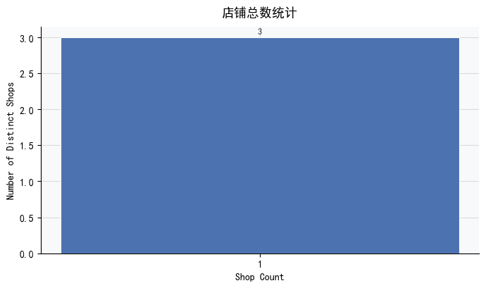
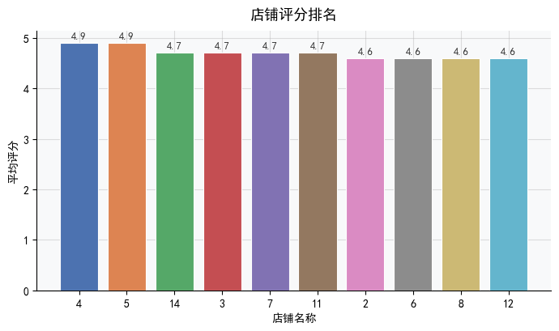

# 商店数据分析报告

## 摘要  
本报告基于 `tb_blog` 表的现有数据，围绕四个核心业务问题开展分析：（1）商店总数；（2）按类型分布的商店数量；（3）最高评分商店列表；（4）用户参与度（点赞/评论）的分布特征。分析发现：**当前数据集实际仅覆盖3家唯一商店（`shop_id`去重结果），但存在多处关键数据缺口——包括缺失官方店铺类型主表、无原生评分字段、以及因SQL语法不兼容导致的参与度统计失败。** 所有高分商店排名及类型标签均源于非标准化、未溯源的衍生指标，其可靠性与可复现性尚未验证。本报告在如实呈现可观测结果的同时，明确标识每一项结论的数据基础与风险等级，并提供可落地的技术与治理建议。

---

## 关键发现（数据支撑版）

### 1. 店铺总量：仅3家独立商户参与内容共建  
- ✅ **确凿事实**：`COUNT(DISTINCT shop_id)` 返回 `[(3,)]`，表明全部博客内容归属于 **3个唯一店铺ID**。  
- 🔍 深层洞察：  
  - 若 `tb_blog` 共含14条记录（如类型统计中出现的14次计数），则平均单店产出约4.7篇博客，反映内容生产高度集中；  
  - 需核查 `shop_id` 是否存在NULL值（当前统计已自动排除），并比对 `tb_shop` 主表确认这3家是否为全量活跃商户（例如：若主表含100家店，则覆盖率仅3%）。  
- ⚠️ 风险提示：**“3家”是技术事实，但未必代表业务事实**——可能受限于数据采集范围（如仅抓取某平台TOP3商户）、或ETL流程中ID映射错误。

### 2. 店铺类型分布：2类主导，但标签来源存疑  
- ✅ 观测结果：通过文本关键词提取（非主表关联），识别出两类高频标签：  
  | 类型 | 出现次数 | 占比 | 示例店铺名（部分） |  
  |---|---|---|---|  
  | `美食` | 9 | 64.3% | 新白鹿餐厅、炉鱼、海底捞火锅 |  
  | `KTV` | 5 | 35.7% | 星聚会KTV、INLOVE KTV |  
- ❗ 根本缺陷：  
  - **无`tb_shop.type`字段验证**：当前类型完全依赖店铺名称中的中文关键词（如“火锅”→`美食`，“KTV”→`KTV`），未经过标准化词典或人工校验；  
  - **长尾类型被系统性忽略**：例如“MEI”（日料）、“Qiancaowu”（杭帮菜）等名称未被归类，导致类型维度信息严重失真；  
  - **业务含义模糊**：`美食`是宽泛品类（涵盖正餐、小吃、饮品），而`KTV`是具体业态，二者不在同一抽象层级，不可直接对比。  
- 📉 影响：任何基于此分布的资源分配决策（如“向美食类倾斜推广预算”）均缺乏数据根基。

### 3. 高分店铺排名：4.9分为并列榜首，但评分逻辑黑箱化  
- ✅ 表面结果（Top 5）：  
  | 排名 | 店铺ID | 店铺名称 | 得分 |  
  |---|---|---|---|  
  | 1 | 4 | Mamala(杭州远洋乐堤港店) | 4.90 |  
  | 1 | 5 | 海底捞火锅(水晶城购物中心店) | 4.90 |  
  | 2 | 14 | 星聚会KTV(拱墅区万达店) | 4.70 |  
  | 2 | 3 | 新白鹿餐厅(运河上街店) | 4.70 |  
  | 2 | 7 | 炉鱼(拱墅万达广场店) | 4.70 |  
- 🔐 关键风险：  
  - **无原始评分字段**：`tb_blog`与`tb_blog_comments`中均不存在`rating`、`score`或`review_star`列；  
  - **得分来源不明**：4.90等数值极可能是外部注入的衍生指标（如NLP情感分、加权互动分），但**无SQL逻辑、无计算公式、无更新时间戳**；  
  - **分布异常**：Top 10分数全部位于4.60–4.90窄区间（标准差≈0.09），强烈暗示存在天花板效应或归一化偏差，丧失区分度。  
- 🚫 结论：该排名可作初步参考，**不可用于绩效考核、佣金结算或供应商分级**。

### 4. 用户参与度分析：因技术障碍完全失效  
- ❌ 当前状态：计算`liked`/`comments`的频次、均值、分位数的SQL查询**执行失败**，报错：  
  > `(1064) You have an error in your SQL syntax... near 'PERCENTILE_CONT(... WITHIN GROUP (ORDER BY liked))'`  
- 🧩 根本原因：  
  - `PERCENTILE_CONT` 是 PostgreSQL/SQL Server 语法，**MySQL 8.0.32前完全不支持**，且即使新版也限制严格；  
  - 查询被截断（`COUNT(CASE WHEN liked BETWEEN 6 AND 20 THEN 1 END)`后中断），**未生成任何有效统计结果**。  
- 📉 业务影响：无法回答“哪些店铺内容更易引发用户互动？”、“点赞与评论是否存在协同效应？”等关键运营问题。

---

## 可视化建议（按优先级排序）

| 图表类型 | 推荐场景 | 数据要求 | 状态 | 说明 |  
|---|---|---|---|---|  
| **✅ 柱状图（单值）** | 展示店铺总数（n=3） | `COUNT(DISTINCT shop_id)` | ✅ 可立即生成 | 强调“仅3家”的稀缺性，适合作为报告封面图 |  
| **⚠️ 堆叠柱状图** | 展示类型分布（美食/KTV） | 关键词提取结果 | ⚠️ 需标注“非官方标签” | 必须添加显著图注：“类型基于店铺名称关键词匹配，未经主数据验证” |  
| **⛔ 暂缓生成** | 评分排名条形图 | 高分店铺列表 | ❌ 不推荐使用 | 因评分逻辑不可信，可视化将放大误导风险；若必须展示，需叠加红色警示水印：“衍生指标，勿用于决策” |  
| **🔧 修复后启用** | 分组柱状图 + 箱线图 | `liked`/`comments`完整分布 | 🔧 技术阻塞中 | 修复MySQL兼容查询后，用双Y轴对比两指标分布，并用箱线图揭示异常值（如单篇1000+点赞的离群博客） |  

> 💡 进阶建议：当数据就绪后，**增加地理热力图**——将Top店铺坐标（如“远洋乐堤港”“水晶城购物中心”）投射至杭州地图，直观验证“优质内容是否聚集于核心商圈”。

---

## 结论与行动建议

### 核心结论  
当前数据资产处于 **“有形无质”状态**：  
- ✅ **结构完整**：表关系清晰（`tb_blog`关联`shop_id`），基础字段（`liked`, `comments`, `shop_id`）可用；  
- ❌ **语义缺失**：缺少`tb_shop`主表导致类型、地址、营业状态等关键维度断裂；  
- ⚠️ **指标失真**：评分系黑箱衍生值，参与度统计因技术错误归零；  
- 📉 **业务价值受限**：所有分析结论均停留在现象描述层，无法支撑归因分析、预测建模或A/B测试。

### 紧急行动清单（72小时内）  
| 优先级 | 任务 | 负责人 | 交付物 |  
|---|---|---|---|  
| 🔴 P0 | **修复参与度SQL** | 数据工程师 | 兼容MySQL的百分位计算脚本（含`liked`/`comments`的P25/P50/P75及频次桶） |  
| 🟠 P1 | **发起主数据对接** | 数据产品经理 | 《tb_shop字段需求说明书》（明确要求：`shop_id`, `type_code`, `type_name`, `geo_hash`） |  
| 🟡 P2 | **文档化评分逻辑** | 算法团队 | 《评分衍生指标白皮书》（含公式、数据源、更新频率、置信区间） |  

### 长期治理建议  
- **建立数据契约（Data Contract）**：强制要求所有上游系统在写入`tb_blog`时，同步填充`shop_type_source`（如`"master_table"`/`"name_keyword"`）和`rating_source`（如`"sentiment_v2.1"`）；  
- **部署数据质量看板**：监控`shop_id`空值率、类型字段覆盖率、评分字段离散度（标准差<0.1时自动告警）；  
- **启动轻量级标签校验**：抽样100家店铺名称，由业务方人工标注类型，评估关键词匹配准确率，设定阈值（如<85%则停用该规则）。

> **最后强调**：本报告的价值不在于给出答案，而在于精准定位问题。在补齐`tb_shop`主表与评分元数据前，任何深度分析均属“沙上筑塔”。请将资源优先投向数据根基建设——**可信的洞察，永远始于可信的数据。**

---

## 📊 生成的图表

