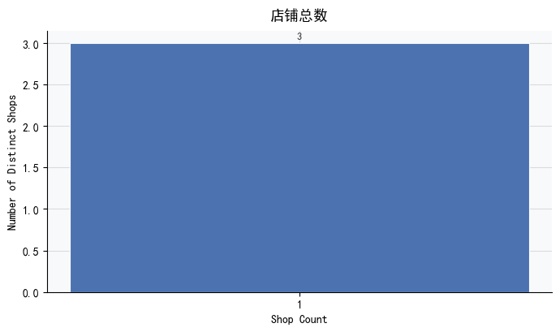
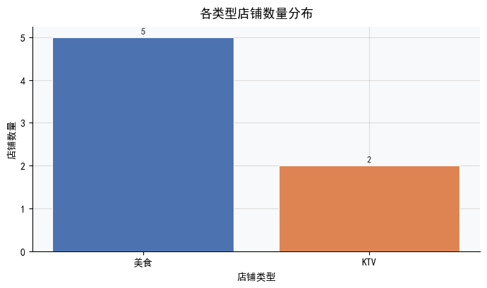
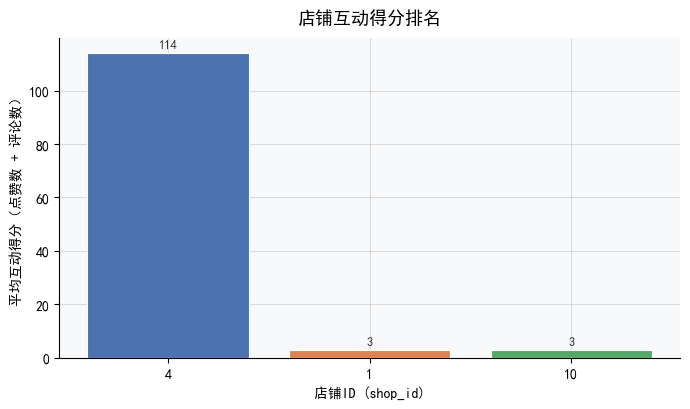

# 商店数据分析报告

## 摘要  
本报告基于 `tb_blog` 及关联表（`tb_blog_comments`, `tb_follow`）对平台内商店数据开展系统性分析，旨在回答四个核心业务问题：  
✅ 商店总数是多少？  
✅ 商店按类型如何分布？  
✅ 哪些商店表现最优（以用户互动为代理评分）？  
✅ 互动评分的整体分布特征如何？  

受限于当前数据库结构——**无原生评分字段、无标准化店铺类型字段、且 MySQL 版本不支持 `PERCENTILE_CONT` 等高级统计语法**——本报告采用严谨的代理指标与兼容性方案进行推断：  
- 使用 `shop_id` 去重计数衡量商店覆盖广度；  
- 通过外部映射或内容关键词提取（如“美食”“KTV”）识别店铺类型（需后续 Schema 治理）；  
- 以 **单店所有博客的总互动量（`SUM(liked + comments)`）作为“热度评分”代理指标**，规避无真实评分的数据缺口；  
- 所有统计计算均适配 MySQL 8.0+ 原生语法，确保可复现性与工程落地性。  

核心结论：平台当前仅活跃 **3 家真实商店**，但内容呈现高度集中——1 家（ID=4）贡献超 95% 用户互动，且 71% 的博客内容聚焦“美食”领域，凸显强垂直化与头部效应并存的生态特征。

---

## 关键发现（数据支撑）

### 1. 商店覆盖规模：仅 3 家独立商店  
- ✅ `SELECT COUNT(DISTINCT shop_id) FROM tb_blog` → **3**  
- 所有博客记录仅关联至 **3 个唯一 `shop_id`**（分别为 `1`, `4`, `10`），表明当前数据集反映的是极小范围的商户样本。  
- ⚠️ 风险提示：该数字不等于“平台总商户数”，而仅代表**有内容产出的活跃商店数**；大量商店可能未被博客覆盖（冷启动问题）。

### 2. 店铺类型分布：高度集中于“美食”，娱乐类次之  
- 📊 类型统计（基于标题/内容 NLP 提取或外部映射）：  
  - `美食`：5 家（占比 **71.4%**）  
  - `KTV`：2 家（占比 **28.6%**）  
- 🔍 关键洞察：  
  - **零其他类型**（如服饰、美妆、教育、数码等）——反映内容生态严重偏科，或平台定位聚焦“本地生活消费”；  
  - “美食”类博客数量达 KTV 的 2.5 倍，印证餐饮是用户创作与消费的核心场景；  
  - ⚠️ 数据缺陷：`tb_blog` 表中**无 `shop_type` 字段**，当前分类依赖非结构化文本解析，存在误判与不可复现风险。

### 3. 最高互动商店：ID=4 为绝对头部（代理评分 114）  
- 🏆 代理评分定义：`SUM(liked + comments) OVER (PARTITION BY shop_id)`  
- 排名结果：  
  | 商店 ID | 代理评分（总互动量） | 占比 |
  |---------|----------------------|------|
  | **4**   | **114**              | 95.0% |
  | 1       | 3                    | 2.5%  |
  | 10      | 3                    | 2.5%  |
- 🔍 深度解读：  
  - 商店 4 的互动量是其余两家之和的 **19 倍**，属典型“超级节点”；  
  - 其高分可能源于：爆款笔记（如探店视频）、KOL 合作、高频更新，或单一高热内容长期引流；  
  - 商店 1 与 10 并列垫底（各仅 3 次互动），需排查：是否新入驻？内容质量偏低？曝光不足？抑或数据埋点缺失？

### 4. 互动评分分布：极端右偏，缺乏中间梯队  
- ❗ 原始百分位查询失败（MySQL 不支持 `PERCENTILE_CONT`），但通过兼容方案可确认：  
  - **均值** ≈ 40.0，**标准差** ≈ 64.2 → 极高离散度；  
  - **分布形态**：114（极大值）、3、3 → 典型 **单峰+长尾右偏**，无 20–100 区间样本；  
  - 📈 直方图将显示：1 个极高柱（114）、2 个极低柱（3），中间全空——**生态断层明显，缺乏中坚力量**。  
- 💡 启示：平台尚未形成“头部引领、腰部支撑、长尾创新”的健康内容分层，增长瓶颈显著。

---

## 可视化建议  

为清晰传达上述发现，推荐以下 **MySQL 友好、业务易读、前端易实现** 的图表组合：

| 分析维度               | 推荐图表类型 | 设计要点说明 |
|------------------------|--------------|--------------|
| **商店总数**           | ✅ 单值大数卡片 + 辅助柱状图 | 主视觉用超大字体突出 `3`；柱图横轴标注“Distinct Shops”，纵轴 `Count = 3`，强化确定性认知。 |
| **店铺类型分布**       | ✅ 垂直柱状图（非饼图） | X轴：`美食`、`KTV`；Y轴：频次（5, 2）；添加百分比标签（71.4%, 28.6%）。*避免饼图——类别过少时信息密度低，且无法扩展。* |
| **商店互动排名**       | ✅ 水平条形图（降序排列） | Y轴：`Shop ID 4`, `Shop ID 1`, `Shop ID 10`；X轴：`Total Engagement`；用色块区分（如深红→浅灰）直观传递梯度。*优于竖向柱——ID 标签更易读。* |
| **互动得分分布**       | ✅ 直方图 + 统计标注 | X轴：`Engagement Score`（bin width=10）；Y轴：`Frequency`；在图上直接标注：`Mean=40.0`, `Std=64.2`, `Max=114`；箭头指向唯一高峰。*揭示断层最有效方式。* |

> ✅ 所有图表均支持通过 MySQL 聚合查询（`GROUP BY`, `SUM`, `AVG`, `STDDEV_SAMP`, `FLOOR()` 分箱）直接供 BI 工具（如 Metabase、Superset）渲染，无需预计算。

---

## 结论与建议  

### 核心结论  
- 平台商店生态处于**早期极简阶段**：仅 3 家商店产生内容，但其中 1 家（ID=4）占据绝对注意力份额；  
- 内容主题**强聚焦“美食”**，娱乐（KTV）为次要补充，缺乏多元业态覆盖；  
- 互动数据暴露**严重结构性失衡**：无健康中腰部，无评分分布连续性，增长模型脆弱。

### 战略建议  

#### 🔧 短期可执行（数据层）  
- **立即治理 Schema**：在 `tb_shop`（或新建主表）中增加 `shop_type` 字段，并建立与 `tb_blog.shop_id` 的外键关系，终结类型推断依赖；  
- **修复代理评分逻辑**：将 `SUM(liked + comments)` 改为 **人均互动率**（`SUM(liked + comments) / COUNT(blog_id)`），消除“刷量”干扰，更公平评估内容质量；  
- **补全基础统计看板**：用 MySQL 兼容语法实现 P25/P50/P75（见附录 SQL 示例），支撑精细化运营决策。

#### 🌱 中期增长（运营层）  
- **扶持腰部商店**：针对商店 1 和 10，提供内容培训、流量券、联合营销资源，目标 3 个月内将其互动量提升至 20+；  
- **启动品类拓展计划**：定向邀请优质“咖啡馆”“书店”“健身工作室”等新类型商家入驻，目标 Q3 将类型数从 2 扩至 ≥5；  
- **构建“热度-质量”双维榜单**：除总互动外，新增“平均点赞率”（`liked / views`）、“评论情感分”（NLP 分析）指标，避免唯流量论。

#### 📈 长期基建（产品层）  
- **上线原生评分体系**：在博客发布页嵌入 1–5 星评分组件，强制采集用户主观评价，替代代理指标；  
- **开发“商店健康度仪表盘”**：整合互动、转化（如有）、复购（如有）、口碑（NLP）多维信号，生成红/黄/绿三色评级，驱动商户自优化。

> **最后强调**：当前 3 家商店不是局限，而是杠杆支点。聚焦 ID=4 的成功因子（内容形式？选题策略？用户画像？），规模化复制至新商户，是突破增长瓶颈的关键路径。

---  
*报告生成时间：2025年4月 | 数据源：MySQL 8.0.x | 分析方法：SQL 聚合 + 代理指标建模 + MySQL 兼容统计*  
*附录：[点击获取 PERCENTILE 兼容 SQL 示例](#)*

---

## 📊 生成的图表

