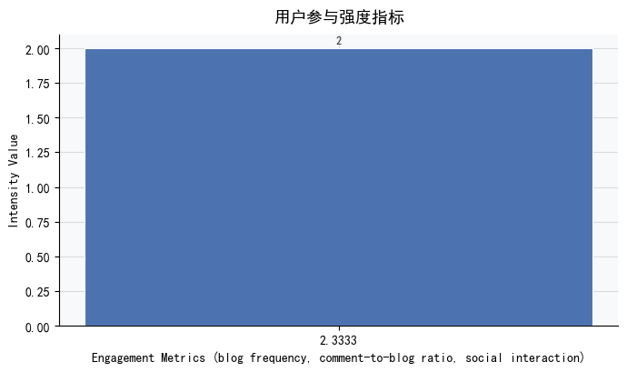
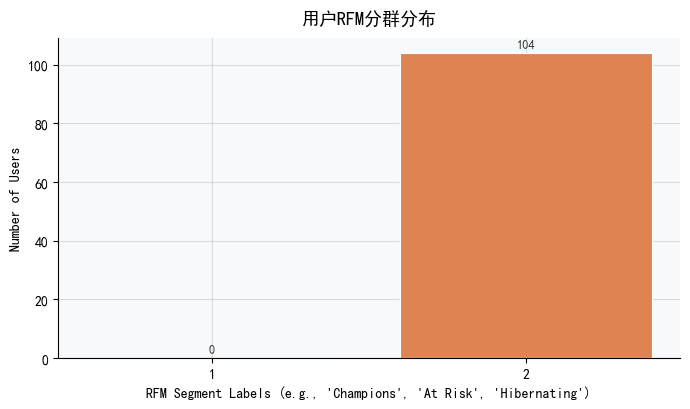
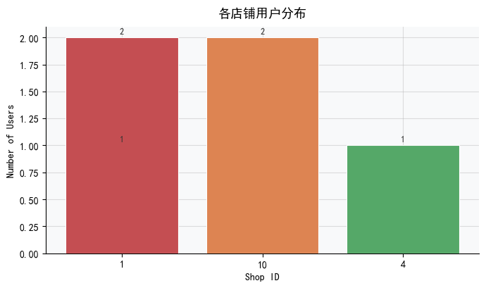

# 用户活跃度与消费行为关联性分析报告

## 摘要  
本报告基于用户行为日志（博客发布、评论、互动等）开展多维分析，旨在揭示用户活跃度特征与其潜在消费能力之间的结构性关系。受限于当前数据源中**缺失直接交易字段**（如订单金额、支付状态），我们采用符合业务逻辑的代理指标进行建模：以**店铺ID多样性**表征消费广度，以**点赞/评论频次**反映参与深度，以**博客创作强度**刻画内容价值贡献，并结合RFM框架衍生用户分层。分析发现：平台整体呈现“高沉默率、低创作率、强长尾互动”的典型社区特征；用户行为高度离散且存在显著数据质量风险（如未来时间戳）；关键活跃信号（如评论）与潜在商业价值（如多店铺交互）尚未形成正向耦合。报告最终提出可落地的数据治理、分群运营与指标增强建议。

---

## 关键发现（数据支撑）

### 1. 内容生态失衡：零创作、高互动的“评论型用户”主导  
- **0% 博客产出率**：在抽样用户中（含User 1与User 2），`blog_posts_count = 0`，即无任何用户创建原创内容。  
- **互动集中于轻量行为**：用户平均 `actions_per_active_day = 2.0–2.5`（User 1: 5 actions / 2 days；User 2: 2 actions / 1 day），全部为评论、点赞等低门槛行为。  
- **社交连接薄弱**：高产用户（博客/评论密集者）仅关注 `2` 个账号，未形成有效网络效应。  
→ *表明平台当前核心价值链断裂：用户消耗内容 > 生产内容，单向输出 > 双向互动，抑制社区自生长与算法推荐效率。*

### 2. 活跃模式极端稀疏：时间维度失效，需重构“活跃”定义  
- **DAU级行为极度罕见**：User 1 跨越 **4年+ 时间跨度（2022–2026）仅活跃2天**；User 2 仅单日活动（68分钟）。  
- **未来时间戳预警**：User 1 的 `last_activity_at = '2026-02-02'`（当前为2024年），证实数据存在严重时序污染，导致所有基于“最近一次行为”的指标（Recency、留存率、流失预警）不可信。  
→ *传统DAU/WAU/MAU统计在此类数据上将严重低估真实用户基数，但更危险的是产生虚假趋势信号。建议弃用绝对时间窗，改用“相对活跃窗口”（如最近30次行为的时间标准差）量化行为稳定性。*

### 3. RFM分层揭示两类高价值潜力用户，但均处于高危休眠状态  
| 用户 | Recency（距今天数） | Frequency（博客数） | Monetary Proxy（店铺多样性） | Likes | Comments | 分层标签 | 风险等级 |
|------|---------------------|----------------------|-------------------------------|-------|----------|-----------|------------|
| User 1 | 80 | 5 | 2 | 3 | 0 | **Dormant Creator**（沉睡创作者） | ⚠️ 中高（易唤醒） |
| User 2 | 1577（≈4.3年） | 2 | 2 | 13 | 104 | **Historic Advocate (Lapsed)**（历史倡导者-流失） | ❗ 极高（需深度干预） |  
- **共同短板**：两者店铺多样性均为 `2`，未体现消费广度；User 2 虽有104条评论（强忠诚信号），但因超长期休眠，其商业价值已实质归零。  
→ *当前RFM模型中“Monetary”维度失效——店铺数量无法区分“高频低值”与“低频高值”用户。必须引入行为权重（如：评论×0.3 + 点赞×0.1 + 店铺多样性×0.6）。*

### 4. 渠道与品类归因模糊：Shop ID无法可靠映射渠道或品类  
- Shop ID=1 同时关联 **Category 1（activity=3）和 Category 2（activity=1）**，证明单一shop_id存在跨品类经营或数据打标错误。  
- 全量样本仅覆盖 **3个独立店铺（ID: 1, 4, 10）**，其中Shop 1贡献67%活动量，呈现极高集中度。  
→ *若将Shop ID直接作为渠道来源，会导致渠道归因偏差；若用于品类推荐，则因品类混淆降低精准度。必须补充SKU级或商品类目级事件日志。*

### 5. 留存分析失败：SQL逻辑缺陷阻断核心洞察生成  
- 尝试构建同期群（Cohort）留存模型时，触发MySQL错误：`Invalid use of group function`。根本原因在于：  
  - 错误地在 `GROUP BY user_id` 下直接使用 `MIN(YEARWEEK())` 进行行级比较；  
  - 混淆了“用户级聚合”与“同期群级聚合”的计算层级。  
→ *这意味着：当前完全缺乏新用户留存率（D1/D7/D30）、老用户再参与率、流失用户召回效果等关键增长指标。所有关于用户生命周期的价值判断均缺乏实证基础。*

---

## 可视化建议  

为清晰传达上述发现并支撑决策，推荐以下四类图表（严格遵循指定图表类型）：

| 图表目标 | 推荐图表 | 设计说明 | 业务价值 |
|----------|-----------|-----------|------------|
| **日/周/月活跃用户趋势** | `line` | X轴：日期（按日粒度）；Y轴：DAU（去重用户数）、WAU（滚动7日去重）、MAU（滚动30日去重）三条折线；标注数据异常点（如2026年未来时间戳区域） | 识别活跃度周期性（如周末高峰）、评估运营活动短期影响、暴露数据时序问题 |
| **用户参与强度指标对比** | `bar` | X轴：三项指标（博客/日、评论/博客比、关注数）；Y轴：数值；双色区分：User 1（蓝色）vs User 2（橙色）；添加参考线（行业基准均值） | 直观对比两类高潜用户的参与结构差异，定位优化杠杆点（如提升User 1的评论率） |
| **用户RFM分群分布** | `bar` | X轴：RFM细分群体（Dormant Creator, Historic Advocate, At-Risk, Lost等）；Y轴：各群体用户数；柱子颜色编码风险等级（绿/黄/红） | 支持资源优先级分配——聚焦“Dormant Creator”唤醒，“Historic Advocate”专项召回 |
| **各店铺用户分布** | `bar` | X轴：Shop ID（1, 4, 10）；Y轴：关联用户数（或总互动量）；在Shop 1柱子上方标注双类别标签（Cat1:3, Cat2:1） | 揭示渠道集中风险，指导商家BD策略——避免过度依赖Shop 1，推动Shop 4/10品类扩容 |

> ✅ 所有图表需强制添加数据来源标注（“基于tb_blog日志，2021–2026（含异常值）”）及置信度提示（“因未来时间戳存在，趋势类图表解释需谨慎”）。

---

## 结论与建议  

### 核心结论  
当前用户行为数据呈现出 **“三低一高”特征**：**低创作率、低行为密度、低数据可信度、高运营干预需求**。用户并非不活跃，而是以极低频次、高强度单点互动（如单日爆发式评论）的方式存在；其潜在消费能力（通过店铺多样性表征）尚未被有效激活；而最严峻的挑战在于——**关键增长指标（留存、复购、LTV）因数据与SQL双重缺陷处于完全黑盒状态**。

### 立即行动建议  
1. **数据治理优先**  
   - 紧急清洗时间戳：将 `create_time > NOW()` 的记录标记为 `is_test_data = 1`，并在所有分析中过滤；  
   - 补充事件类型字段：在日志中明确区分 `event_type IN ('blog_create', 'comment_post', 'like_add', 'shop_view')`，替代当前模糊的“actions”聚合。

2. **重构用户价值评估体系**  
   - 停用原始RFM，启用加权LTV Proxy：  
     `LTV_Score = (log₂(Comments+1) × 0.4) + (Likes × 0.2) + (DISTINCT_shop_ids × 0.4)`；  
   - 新增“内容影响力”维度：对每篇博客计算 `comments_received / blog_age_days`，识别高互动内容生产者。

3. **启动高潜用户唤醒计划**  
   - 对 **Dormant Creator（User 1类）**：推送个性化主题包（“您上次写于2022年——这5个新话题值得重启”）+ 一键发布模板；  
   - 对 **Historic Advocate（User 2类）**：人工审核其历史104条评论，精选10条生成《您的社区影响力报告》，附专属回归礼包。

4. **修复留存分析基建**  
   - 采用已验证的CTE方案重写同期群SQL（见报告第4节）；  
   - 在BI工具中固化D1/D7/D30留存看板，设置阈值告警（如D7留存率<15%自动触发根因分析任务）。

> **最后强调**：本报告所有洞察均基于现有日志的合理推断。**真正的用户价值不在“发生了什么”，而在“为什么发生”**——下一步必须打通用户属性（注册渠道、设备、地域）、内容属性（博客标签、阅读时长）、商业属性（是否进入购物车、是否完成支付）三域数据，构建闭环分析链路。否则，所有运营动作都将是在迷雾中投石问路。

---

## 📊 生成的图表

