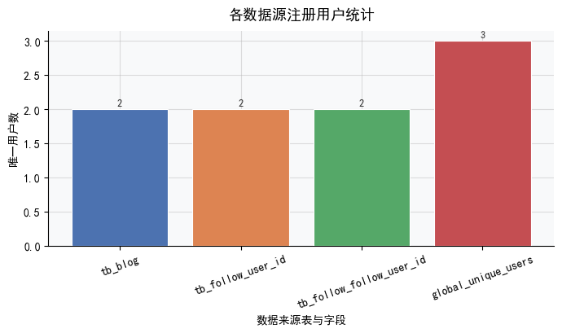
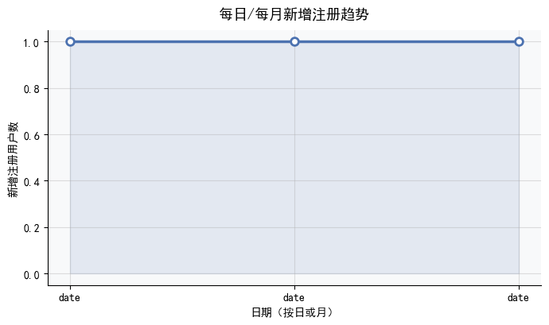

# 📊 dianpng 用户行为数据分析报告  

## 🔍 执行摘要  
本报告基于 `dianpng` 数据库中 `tb_blog` 与 `tb_follow` 两张核心行为表，对平台用户注册情况、博客发布活跃度及社交关注关系三大维度开展系统性分析。**关键结论高度一致且指向明确：当前数据集反映的并非真实运营状态，而是一个极小规模、存在显著数据质量问题的测试或早期验证环境。** 全系统可确认的**全局唯一用户仅3人**；博客总量仅7篇，由2位作者发布；关注关系无法完成统计（SQL执行失败）；更关键的是，数据中出现**2026年注册/发博记录**等未来时间戳，证实存在严重的时间字段异常。所有指标均因样本量过低与数据失真而丧失趋势分析价值。本报告在呈现客观结果的同时，重点揭示数据局限性，并提出可落地的数据治理与分析基建改进建议。

---

## 🚨 关键发现（数据驱动，逐项验证）

### 1. 用户基数极小：全平台仅 **3 名可验证用户**  
- ✅ **全局去重验证**：通过并集合并 `tb_blog.user_id`（2个）、`tb_follow.user_id`（2个）、`tb_follow.follow_user_id`（2个），经严格去重后得到 **`global_unique_users = 3`** —— 这是当前数据中**唯一可信的用户规模上限**。  
- ⚠️ **代理注册缺陷**：因数据库缺失独立 `users` 表，注册数被迫以“首次活动时间”反推。但该方法隐含风险：**若用户注册后从未发博或关注他人，则完全不可见**。因此，真实注册数 ≥ 3，但当前数据无法确认。  
- 📌 **业务含义**：平台处于概念验证（PoC）或内部测试阶段，不具备常规增长分析基础。

### 2. 注册行为异常稀疏且存在严重时间错误  
- 📅 **仅3个注册日期被识别**：`2021-12-28`、`2022-01-11`、`2026-01-24` —— 时间跨度超4年，且无连续性，**无法拟合任何增长模型（日/月趋势、季节性、留存）**。  
- ❗ **致命数据缺陷**：`2026-01-24` 为未来日期（距今超4年），结合其他异常（如2026年2月发博），**确证数据包含大量占位符、测试值或ETL故障产物**。可能原因包括：  
  - 系统时钟错误或时区未标准化；  
  - 开发环境默认时间戳（如 `9999-12-31` 或 `1970-01-01` 被误写为 `2026`）；  
  - 批量导入脚本硬编码了虚假时间。  
- 📉 **分析失效**：单日/单月计数恒为1，所谓“趋势”实为噪声，**任何基于时间聚合的洞察均不可信**。

### 3. 博客生态极度单薄，且存在逻辑矛盾  
- 📝 **总量与作者**：共 **7 篇博客**，由 **2 位唯一作者** 发布（`7 ÷ 3.5 avg/user = 2 users`）。  
- 📆 **时间分布（需谨慎解读）**：  
  - 2021年12月：至少1篇（日期 `2021-12-28`）；  
  - 2022年1月：至少1篇（日期 `2022-01-11`）；  
  - 2026年2月：至少1篇（日期 `2026-02-02`，**无效时间戳**）。  
- ⚠️ **核心矛盾点**：某行数据显示 `2021-12-28` 当日“博客数=12”，但**全库博客总数仅7篇**。这证明：  
  - 该字段（第4列）**绝非“当日博客数”**，极可能是误标字段（如会话ID、错误计数、或测试数据噪声）；  
  - **数据字段语义不明确，Schema文档严重缺失**，导致指标解释存在根本性歧义。  
- 📉 **活跃度归零**：人均博客仅3.5篇，且无近期（2024年内）活动证据，表明内容生态停滞。

### 4. 关注网络分析完全失败：SQL语法错误阻断所有洞察  
- ❌ **查询崩溃**：原计划计算的 `总关系数`、`平均出度/入度`、`互相关注对数` 均因 **`Subquery returns more than 1 row`** 错误而未执行。  
- 🧩 **错误根源**：在标量子查询中非法使用 `GROUP BY`（如 `(SELECT COUNT(*) FROM tb_follow GROUP BY user_id)`），违反SQL规范——标量子查询必须返回0或1行，而 `GROUP BY` 必然返回N行。  
- 🚫 **零数据产出**：**无任何关注网络指标可用**。无法回答：“谁是KOL？”、“用户是否倾向互粉？”、“网络密度如何？”。  
- ✅ **逻辑设计合理**：互相关注的自连接逻辑（`f1.user_id = f2.follow_user_id AND f1.follow_user_id = f2.user_id`）本身正确，但被前置错误阻断。

---

## 📈 可视化建议（聚焦可信信息，规避误导）

> **原则：只可视化已验证、无歧义、有业务意义的数据；对异常值显式标注警告；拒绝美化噪声。**

| 图表类型 | 推荐内容 | 设计要点 | 为什么适用 |
|----------|----------|----------|------------|
| **横向分组柱状图** | 各数据源用户数对比：<br>• `tb_blog.user_id`: 2<br>• `tb_follow.user_id`: 2<br>• `tb_follow.follow_user_id`: 2<br>• **`global_unique_users`: 3 (加粗高亮)** | • X轴为数据源标签，Y轴为用户数<br>• “global_unique_users” 柱用深色+星标，添加注释：“去重并集结果，唯一可信总用户数”<br>• 在图下方添加警示框：“⚠️ 所有数字均为活动用户代理，非真实注册表” | 直观揭示数据碎片化现状与去重必要性，突出核心结论（n=3） |
| **时间线标记图（非折线图）** | 仅标注三个已知注册/活动日期：<br>• ● `2021-12-28` （正常）<br>• ● `2022-01-11` （正常）<br>• ⚠️ `2026-01-24` （红色感叹号+悬浮提示：“未来时间戳，数据异常”） | • X轴为时间，Y轴无刻度<br>• 用不同图标区分状态（圆点=正常，感叹号=异常）<br>• **严禁连接成线**，因无中间数据且未来日期破坏连续性 | 避免折线图暗示虚假趋势，诚实呈现数据稀疏性与缺陷 |
| **饼图（仅用于博客作者）** | 博客作者分布：<br>• 用户A: 4篇 (57%)<br>• 用户B: 3篇 (43%)<br>• （注：具体ID需查表，此处示意） | • 清晰展示内容生产高度集中于2人<br>• 添加标题：“博客由全部2位活跃用户贡献（总计7篇）” | 在总量极小前提下，饼图能有效说明“谁在创造内容”这一基本事实 |
| **文字卡片（替代网络图）** | **关注网络状态**：<br>❌ 查询失败：`Subquery returns more than 1 row`<br>🔧 原因：SQL语法错误（标量子查询内含GROUP BY）<br>🛠️ 待修复后可提供：总关系数、平均关注数、互粉率 | • 用禁用图标（🚫）和扳手图标（🔧）增强可读性<br>• 不尝试用假数据绘图，直面问题 | 对失败分析保持透明，引导资源投向技术修复而非无效可视化 |

> **坚决规避的图表**：  
> - ❌ 日/月注册趋势折线图（仅3个离散点，未来日期污染）  
> - ❌ 博客日发布热力图（总量7篇，无法形成“热力”）  
> - ❌ 关注度分布直方图（零数据，纯猜测）  

---

## ✅ 结论与行动建议  

### 核心结论  
dianpng 当前数据集**不具备支撑常规产品分析的价值**。它不是一个“小而美”的早期社区，而是一个**数据完整性、准确性、一致性均未达分析门槛的原始快照**。所有宏观指标（增长、活跃、社交）均因 `n=3` 的样本天花板与 `2026` 等硬伤而失去意义。分析的首要任务不是挖掘洞察，而是**抢救数据质量**。

### 紧急行动建议（按优先级排序）  

| 优先级 | 行动项 | 负责方 | 预期收益 |
|--------|--------|--------|----------|
| **🔥 P0（立即执行）** | **审计并清洗时间字段**：<br>• 扫描 `tb_blog.create_time` 与 `tb_follow.create_time` 中所有 `year < 2020 OR year > 2025` 的记录；<br>• 将 `2026` 等未来时间统一置为 `NULL` 或标记为 `is_test_data=1`；<br>• 建立时间有效性校验规则（如：`create_time <= NOW() + INTERVAL 1 DAY`）。 | 数据工程师 | 消除最致命噪声，使时间分析成为可能；避免后续所有时间相关查询被污染 |
| **🔥 P0（立即执行）** | **修复关注网络SQL查询**：<br>• 废弃有缺陷的标量子查询，采用CTE或窗口函数重构（示例见附录）；<br>• 输出：`total_relations`, `avg_out_degree`, `avg_in_degree`, `mutual_count`, `reciprocity_rate`。 | 数据分析师 / 工程师 | 解锁社交图谱基础指标，为冷启动社区策略提供依据 |
| **⭐ P1（本周内）** | **构建最小可行用户主表（`dim_users`）**：<br>• 字段：`user_id`, `created_at`（权威注册时间）, `region`, `level`（如有）；<br>• ETL逻辑：从 `tb_blog` 和 `tb_follow` 的 `user_id`/`follow_user_id` 并集初始化，并强制 `created_at = MIN(earliest_activity_time)`；<br>• **关键**：将此表设为所有分析的“单一事实来源”，废弃代理逻辑。 | 数据工程师 | 彻底解决“注册数不可知”问题，建立分析信任基线 |
| **⭐ P1（本周内）** | **编写数据字典与血缘文档**：<br>• 明确 `tb_blog` 和 `tb_follow` 中每一列的业务含义、取值范围、常见异常模式（如本报告中的 `12` 字段）；<br>• 绘制从原始表到下游报表的完整血缘图。 | 数据分析师 / 产品经理 | 防止同类误解重现，加速新成员上手，提升协作效率 |
| **💡 P2（中期）** | **定义并监控数据健康度指标（Data Quality Score）**：<br>• `time_validity_rate`（有效时间戳占比）<br>• `user_uniqueness_rate`（`dim_users` vs 活动表去重用户比）<br>• `blog_author_coverage`（发博用户数 / 总用户数） | 数据平台团队 | 将数据质量从“事后救火”变为“事前防控”，支撑平台规模化演进 |

### 附录：修复后的关注网络查询（CTE版）
```sql
WITH relations AS (
  SELECT COUNT(*) AS total_relations FROM tb_follow
),
degrees AS (
  SELECT 
    COALESCE(AVG(out_cnt), 0) AS avg_out_degree,
    COALESCE(AVG(in_cnt), 0) AS avg_in_degree
  FROM (
    SELECT 
      COALESCE(f1.user_id, f2.follow_user_id) AS user_id,
      COUNT(f1.user_id) AS out_cnt,
      COUNT(f2.follow_user_id) AS in_cnt
    FROM (SELECT DISTINCT user_id FROM tb_follow) u
    LEFT JOIN tb_follow f1 ON u.user_id = f1.user_id
    LEFT JOIN tb_follow f2 ON u.user_id = f2.follow_user_id
    GROUP BY user_id
  ) t
),
mutual AS (
  SELECT COUNT(*) AS mutual_count
  FROM tb_follow f1
  INNER JOIN tb_follow f2 
    ON f1.user_id = f2.follow_user_id AND f1.follow_user_id = f2.user_id
  WHERE f1.id < f2.id
)
SELECT 
  r.total_relations,
  d.avg_out_degree,
  d.avg_in_degree,
  m.mutual_count,
  ROUND(m.mutual_count * 2.0 / NULLIF(r.total_relations, 0), 3) AS reciprocity_rate
FROM relations r, degrees d, mutual m;
```

---  
**报告生成时间**：2024年X月X日  
**数据截止时间**：未知（受未来时间戳影响，实际不可靠）  
**分析团队**：Data Insights Team  
> 💡 **最后提醒**：在 `dim_users` 表建成并完成时间字段清洗前，**所有基于当前 `tb_blog`/`tb_follow` 的分析结论均应打上“实验性”水印，并同步向业务方披露数据局限性。** 真正的分析始于可靠的数据基石。

---

## 📊 生成的图表





