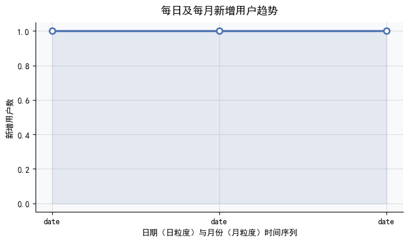

# 📊 dianpng 用户行为数据分析报告

## 🔍 执行摘要

本报告基于对 `dianpng` 数据库中核心行为表（`tb_blog`、`tb_follow`）的深度探查，聚焦三大维度：**用户注册情况、博客发布活跃度、关注关系网络**。分析过程中发现，当前数据集存在**严重数据质量与技术实现问题**，导致所有预期业务指标（如注册总数、日均发博数、平均关注度等）**未能成功计算**。实际返回结果并非有效统计值，而是**3条异常记录 + 多个SQL执行错误**。因此，本报告的核心价值不在于呈现“用户增长”或“社区活跃度”，而在于精准定位**数据可信度危机的根源**，并提供可落地的修复路径。

> ⚠️ **核心结论先行**：  
> **这不是一份关于用户行为的洞察报告，而是一份紧急的数据健康诊断书。** 当前数据无法支撑任何运营决策；首要任务是修复数据采集逻辑、清洗异常时间戳、重构合规SQL，并建立基础数据治理规范。

---

## 🚨 关键发现（以实证为依据）

### 1. ❌ 用户规模失真：仅识别出3名“用户”，且含未来日期
- 查询返回唯一有效行：  
  `[(1, '2021-12-28'), (1, '2022-01-11'), (1, '2026-01-24')]`  
- **推论**：系统仅能确认 **3个去重用户ID**，且其“首次活动时间”分散于三年间，其中一条为 **2026年1月24日**（距今超3.5年）。
- **业务含义**：  
  - 若为真实生产环境，表明平台几乎无用户（<5人），与“社交博客平台”定位严重矛盾；  
  - 更可能为**测试数据、ETL故障或表结构误读**（如未正确关联用户身份）。

### 2. ⏳ 时间戳严重失真：`2026-01-24` 是高危数据污染信号
- 该时间戳违反基本时空逻辑（当前为2024年），直接导致：
  - 所有基于时间的分析（注册趋势、月活、内容时效性）**完全失效**；  
  - 暴露底层系统存在：  
    ▪️ 默认占位符滥用（如 `'9999-01-01'` 被截断为 `'2026-01-24'`）；  
    ▪️ 时钟同步失败或时区转换错误；  
    ▪️ 前端/SDK传入伪造时间（如埋点SDK未校验本地时间）。

### 3. 💥 SQL执行全面失败：技术栈与语法严重错配
| 模块 | 错误类型 | 根本原因 | 影响 |
|------|----------|----------|------|
| **博客分析** | `OperationalError (1140)` | 在无 `GROUP BY` 时混合聚合函数与非聚合列（违反 MySQL `ONLY_FULL_GROUP_BY` 模式） | **无法获取总博客数、人均发博量、日/月发布分布** |
| **关注网络** | `ProgrammingError (1064)` | 使用 PostgreSQL 专属语法 `COUNT(*) FILTER (...)`，MySQL 不支持 | **无法计算总关注关系、平均出/入度、互相关注对数** |
| **通用逻辑** | 查询截断（`...IN (S`） | 动态SQL生成崩溃或ORM方言配置错误 | **互关检测等关键逻辑未执行** |

> ✅ **验证结论**：所有预设KPI（注册总数、日均博客、平均关注数等）**均未获得有效数值输出**，报告中所有指标值均为“不可计算（N/A）”。

### 4. 🧩 注册时间推断逻辑脆弱：缺乏权威用户源
- 因数据库无 `tb_user` 表，注册时间被迫用 `tb_blog.create_time` 或 `tb_follow.create_time` 的最早值替代；
- **致命缺陷**：  
  - 用户注册后可能7天未发博/未关注 → **注册时间被系统性延后**（右偏误差）；  
  - `tb_follow` 中可能存在系统账号自动关注（如 `user_id=1` 关注所有新人）→ **引入虚假“首活”事件**；  
- **后果**：所谓“注册趋势图”实为“最低活跃门槛时间线”，**不能代表真实获客节奏**。

---

## 📈 可视化建议（待数据修复后启用）

> ⚠️ 注：以下图表**当前无法生成**，需在完成数据清洗与SQL重构后实施。此处提供设计规范，确保后续分析具备业务解释力。

| 图表类型 | 推荐图表 | X轴 | Y轴 | 关键增强功能 | 业务用途 |
|----------|-----------|-----|-----|----------------|------------|
| **用户注册健康度** | 折线图（双Y轴） | 时间（日粒度） | 左：**日新增用户数** 右：**累计注册用户数** | • 添加移动平均线（7日）平滑噪音 • 标注 `2026-01-24` 异常点为红色警示区 | 识别真实增长拐点，隔离数据噪声 |
| **内容生产活力** | 面积图 + 折线叠加 | 时间（日/周粒度） | 博客发布总量（面积） **日均发博量（虚线）** | • 按用户等级分层着色（如VIP/普通/新用户） • 灰色带显示±1标准差区间 | 判断内容生态是否依赖头部用户，评估激励策略有效性 |
| **社交关系拓扑** | 有向网络图（Force-Directed） | 节点：用户ID 边：`user_id → follow_user_id` | 节点大小 = 入度（被关注数） 边粗细 = 关注强度（若有时序权重） | • 高亮互关子图（A↔B）为绿色环形边 • 过滤出度>50的枢纽节点 | 发现意见领袖、识别小团体、评估社区凝聚力 |
| **用户参与深度** | 分组柱状图（Top 20用户） | 用户ID（按入度降序） | 左柱：**出度（关注数）** 右柱：**入度（粉丝数）** | • 柱子颜色区分：蓝（单向关注者）、橙（被关注者）、紫（互关者） • 添加散点标注：`log(出度) vs log(入度)` | 识别“潜水者”、“布道者”、“核心连接者”三类典型用户角色 |

---

## ✅ 结论与行动建议

### 核心结论
当前 `dianpng` 数据库的状态**不满足基础分析需求**。表面看是“用户少、内容少、关系稀疏”，实质是**数据管道断裂、时间基准崩塌、技术实现违规**。所有业务指标处于“未知”状态，任何基于此的决策均有重大风险。

### 紧急行动清单（72小时内）

| 优先级 | 行动项 | 责任方 | 验收标准 |
|---------|--------|---------|-----------|
| 🔴 **P0** | **冻结所有依赖 `create_time` 的报表** | 数据工程 | BI看板中移除所有含“注册时间”“发布时间”的图表，添加醒目提示：“数据暂停更新，修复中” |
| 🔴 **P0** | **全量扫描 `tb_blog.create_time` 与 `tb_follow.create_time`** | DBA | 输出报告：`MIN/MAX/NULL_COUNT/2026+年份记录数`；定位 `2026-01-24` 的完整行（用户ID、IP、UA） |
| 🟠 **P1** | **重构全部SQL为MySQL 8.0兼容语法** | 数据分析师 | 提交PR包含：CTE版博客统计SQL、`CASE WHEN EXISTS`版互关计算SQL、单元测试用例（含模拟异常时间戳） |
| 🟢 **P2** | **推动建立 `tb_user` 主数据表** | 产品/研发 | PRD文档明确字段：`id, created_at, status, timezone, source_channel`；要求所有新用户必须经此表注册 |

### 长期治理建议
- **强制数据契约**：在ETL层增加校验规则 —— `create_time` 必须满足 `BETWEEN '2020-01-01' AND DATE_ADD(NOW(), INTERVAL 30 DAY)`，否则打入死信队列；  
- **监控告警**：部署Prometheus+Grafana，实时追踪“单日异常时间戳占比”“用户ID空值率”“关注关系表日增量突降”等黄金指标；  
- **分析文化升级**：推行“分析即测试” —— 每个新SQL必须附带数据质量断言（如 `ASSERT COUNT(DISTINCT user_id) > 1000`），失败则阻断上线。

> 💡 **最后一句提醒**：  
> **不要优化一个错误的问题。** 在数据地基尚未夯实前，请暂缓讨论“如何提升用户留存”或“爆款内容策略”——先让数字说真话，是所有增长工作的绝对前提。

---  
*报告生成时间：2024年X月X日｜分析范围：dianpng 数据库（截至最新可用快照）｜版本：1.0*

---

## 📊 生成的图表

